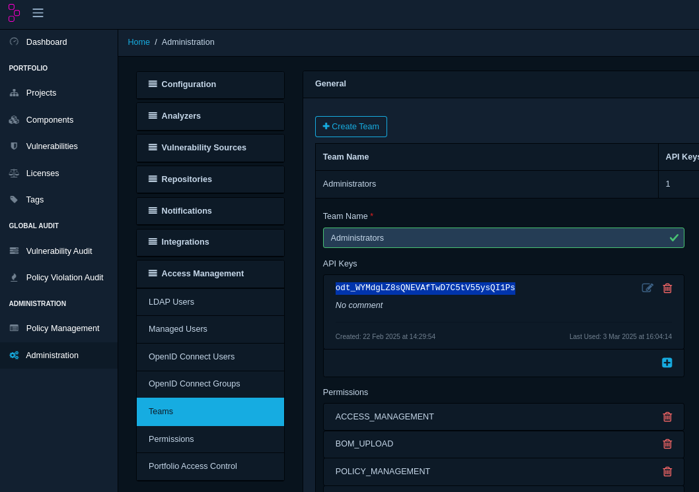
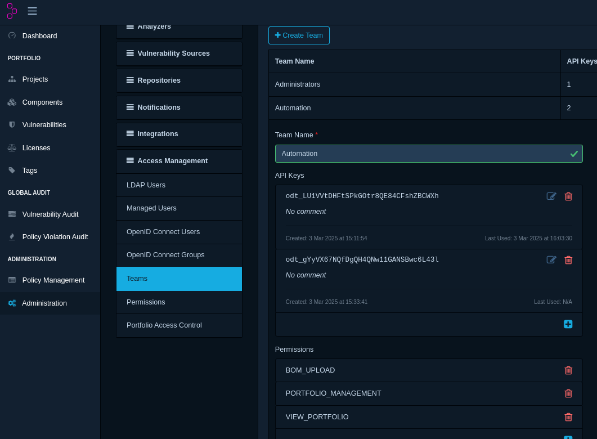

# 🔹 Folder --> DependencyTrack Examples 🔹

Scan SBOM from Folder System(adapter) and upload it to dtrack System(adapter)

## Overview

`sbommv` is a tool designed to transfer SBOMs (Software Bill of Materials) between systems. It operates with two different systems. In this case:

- **Input (Source) System** → Fetches SBOMs  --> **Folder**
- **Output (Destination) System** → Uploads SBOMs  --> **dtrack**

### Scan SBOMs from local Folder

- By default SBOM will be scanned from root folder, in order to scans SBOMs from all sub-directories or recursive directories, provide a flag, `--in-folder-recursive=true`

### Uploading SBOMs to dtrack

Once SBOMs are fetched, they need to be uploaded to DependencyTrack. To use DependencyTrack, you need to:

1. Run a DependencyTrack locally in your system via [docker](https://docs.dependencytrack.org/getting-started/deploy-docker/#quickstart-manual-execution).

    ```bash
    # Pull the image from the Docker Hub OWASP repo
    docker pull dependencytrack/bundled

    # Creates a dedicated volume where data can be stored outside the container
    docker volume create --name dependency-track

    # Run the bundled container with 8GB RAM on port 8080
    docker run -d -m 8192m -p 8080:8080 --name dependency-track -v dependency-track:/data dependencytrack/bundled
    ```

2. Go to <http://localhost:8080>
3. Login with [user and password](https://docs.dependencytrack.org/getting-started/initial-startup/):
   - user: admin
   - password: admin
4. Now change your password.
5. Finally you landed into homepage of DependencyTrack platform.
6. Let's create `DTRACK_API_KEY` token, which is important to access the platform.
7. On the left hand side, go to **Adminstration** --> **Access Management** --> **Teams** --> click on **Adminsitrator** -->  copy the below *API keys*, something like this:
    
8. Now, export this token in your CLI, before running `sbommv`

```bash
export DTRACK_API_KEY="odt_WYMdgLZ8sQNEVAfTwD7C5tV55ysQI1Ps"
```

**NOTE**:

- In case you don't want to leverage your API key with soo much permission, then you can proceed with Automation one, and make sure to allow all these below permission:
  - `VIEW_PORTFOLIO`
  - `BOM_UPLOAD`
  - `PORTFOLIO_MANAGEMENT`

- see below image:

    

- **Automation** keys are best for CI/CD pipelines.

## 1. Basic Transfer(Single Repository): GitHub  → DependencyTrack

### 1.1 From root Folder(no recursion)

```bash
sbommv transfer --input-adapter=folder --in-folder-path="temp" \
                 --output-adapter=dtrack --out-dtrack-url="http://localhost:8081"
```

- **What this does**:
  - Scan SBOMs from the `temp` directory.
  - dtrack client automatically creates a new project with name `sub-dir` with project version `latest`
  - And upload the scanned SBOMs to dtrack

### 1.2 From root Folder as well as sub-directories(recursion)

```bash
sbommv transfer --input-adapter=folder --in-folder-path="temp" --in-folder-recursive=true \
                 --output-adapter=dtrack --out-dtrack-url="http://localhost:8081"
```

- **What this does**:
  - Scan SBOMs from the `temp` as well as all it's sub-directories.
  - dtrack client automatically creates a new project with name `sub-dir` with project version `latest`
  - And upload the scanned SBOMs to dtrack

## 2. Dry-Run Mode (No Upload, Just Simulation)

### 2.1 From root Folder(no recursion)

```bash
sbommv transfer --input-adapter=folder --in-folder-path="temp" \
                 --output-adapter=dtrack --out-dtrack-url="http://localhost:8081" --dry-run
```

- **What this does**:
  - Scan SBOMs in a root dir `temp` (simulates the process).
  - Displays what would be uploaded (preview mode)

### 2.2 From root Folder as well as sub-directories(recursion)

```bash
sbommv transfer --input-adapter=folder --in-folder-path="temp" --in-folder-recursive=true \
                 --output-adapter=dtrack --out-dtrack-url="http://localhost:8081" --dry-run
```

- **What this does**:
  - Scan SBOMs from root dir `temp` as well as it's all sub-dir (simulates the process).
  - Displays what would be uploaded (preview mode)

## Conclusion

These examples cover various ways to fetch and upload SBOMs using sbommv. Whether you are fetching SBOMs from a single repo, an entire organization, or using a specific branch, sbommv provides flexibility to handle it efficiently.
