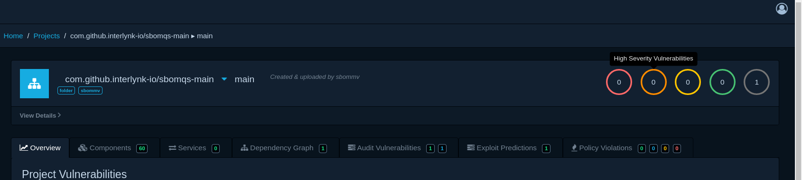

# 🔹 Folder(Real time monitoring) --> DependencyTrack Examples 🔹

This guide shows how to use `sbommv` to transfer SBOMs continously from a local **folder** via real-time monitoring to a **dtrack**(Dependency-Track).

## 📘 Overview

`sbommv` is designed to automate SBOM transfers between systems using a modular adapter-based architecture.

In this example:

- **Input (Source) System** → `folder` (monitors a folders continously in daemon mode)
- **Output (Destination) System** → `dtrack` (uploads SBOMs to Dependency-Track)

### 🗂️ Monitor SBOMs from local Folder

- By default, sbommv monitor only the root of the folder. To include all nested directories, use:
flag, `--in-folder-recursive=true`
The monitoring of a folder is done on the following basis:
- Any SBOM file is added to the folder.
  - It will triggered 2 events:
    - `CREATE` and `WRITE`
- Any SBOM file is modified in the folder.
  - It triggered only 1 events:
    - `WRITE`
- Any SBOM file is removed from the folder.
  - It triggered 2 events:
    - `REMOVE` and `REPLACE`
- Any SBOM file is renamed:
  - It triggered 2 events:
    - `REPLACE` and `WRITE`

### 🚀 Real-time Uploading SBOMs to Dependency-Track(dtrack)

Once SBOMs are triggered in a local folder, they need to be uploaded to DependencyTrack. To setup DependencyTrack, follow this [guide](https://github.com/interlynk-io/sbommv/blob/v0.0.3/examples/setup_dependency_track.md).

## ✅ Transfer SBOMs

### 1. From Root Folder Only (no recursion) --> dtrack

Let's create a dir `demo`, and start monitoring it and later will add SBOM to it

```bash
sbommv transfer --input-adapter=folder --in-folder-path="demo"  --output-adapter=dtrack --out-dtrack-url="http://localhost:8081"  -d        

2025-03-31T14:18:56.410+0530	INFO	logger/log.go:102	Initializing SBOM real-time monitoring for folder in daemon mode	{"path": "demo"}
```

Now, let's add some SBOMs to it from another terminal.

```bash
go run main.go transfer --input-adapter=github --in-github-url="https://github.com/interlynk-io/sbomqs" --output-adapter=folder --out-folder-path=demo
2025-03-31T14:22:46.608+0530	INFO	logger/log.go:102	SBOM uploading processing done, no more SBOMs left
2025-03-31T14:22:46.609+0530	INFO	logger/log.go:102	Total SBOMs	{"count": 1}
2025-03-31T14:22:46.609+0530	INFO	logger/log.go:102	Successfully Uploaded	{"count": 1}

```

You will see that an event is Triggered as soon as the SBOM is added to the folder `demo`

```bash

2025-03-31T14:40:25.944+0530	INFO	logger/log.go:102	Event Triggered	{"name": "CREATE        \"demo/61780de6-7dc3-4f33-8132-dbc7e69270c9.sbom.json\""}
2025-03-31T14:40:25.945+0530	INFO	logger/log.go:102	Event Triggered	{"name": "CREATE        \"demo/61780de6-7dc3-4f33-8132-dbc7e69270c9.sbom.json\""}
2025-03-31T14:40:25.947+0530	INFO	logger/log.go:102	Detected SBOM File	{"path": "demo/61780de6-7dc3-4f33-8132-dbc7e69270c9.sbom.json"}
2025-03-31T14:40:25.947+0530	INFO	logger/log.go:102	Event Triggered	{"name": "WRITE         \"demo/61780de6-7dc3-4f33-8132-dbc7e69270c9.sbom.json\""}
2025-03-31T14:40:25.947+0530	INFO	logger/log.go:102	Event Triggered	{"name": "WRITE         \"demo/61780de6-7dc3-4f33-8132-dbc7e69270c9.sbom.json\""}
2025-03-31T14:40:25.949+0530	INFO	logger/log.go:102	Detected SBOM File	{"path": "demo/61780de6-7dc3-4f33-8132-dbc7e69270c9.sbom.json"}
2025-03-31T14:40:26.241+0530	INFO	logger/log.go:102	Successfully uploaded SBOM to dependency track	{"project": "com.github.interlynk-io/sbomqs-main", "version": "main", "file": "61780de6-7dc3-4f33-8132-dbc7e69270c9.sbom.json"}
2025-03-31T14:40:26.352+0530	INFO	logger/log.go:102	Successfully uploaded SBOM to dependency track	{"project": "com.github.interlynk-io/sbomqs-main", "version": "main", "file": "61780de6-7dc3-4f33-8132-dbc7e69270c9.sbom.json"}

```

As soon as the SBOM is added to `demo` folder the following events are triggered:

- CREATE a file name `07752512-aeb6-4e10-afac-19aad8e3603e.sbom.json`
- It detects whether the file is SBOM or not.
- WRITE a content to the file `07752512-aeb6-4e10-afac-19aad8e3603e.sbom.json`

If you check `projects` of dependency-track, a new project with `com.github.interlynk-io/sbomqs-main` is created and uploaded.


### 2 From root Folder + sub-directories(recursion) --> dtrack

```bash
sbommv transfer --input-adapter=folder --in-folder-path="demo" --in-folder-recursive=true  --output-adapter=dtrack --out-dtrack-url="http://localhost:8081"  -d
```

Now create a directory `xyz` within `demo` from another terminal.

```bash
mkdir -p demo/xyz
```

The event for directory creation will be triggered:

```bash
2025-03-31T15:31:32.676+0530	INFO	logger/log.go:102	Event Triggered	{"name": "CREATE        \"demo/xyz\""}
2025-03-31T15:31:32.676+0530	INFO	logger/log.go:102	Event Triggered	{"name": "CREATE        \"demo/xyz\""}
2025-03-31T15:31:32.676+0530	INFO	logger/log.go:102	New directory created	{"path": "demo/xyz"}
2025-03-31T15:31:32.676+0530	INFO	logger/log.go:102	Added new directory to watcher	{"path": "demo/xyz"}
2025-03-31T15:31:32.676+0530	INFO	logger/log.go:102	No files in new directory, skipping	{"path": "demo/xyz"}

```

Now pull up SBOMs from github(api method) to folder `demo/xyz`

```bash
transfer --input-adapter=github --in-github-url="https://github.com/interlynk-io/sbomqs" --output-adapter=folder --out-folder-path=demo/xyz
2025-03-31T15:32:52.713+0530	INFO	logger/log.go:102	SBOM uploading processing done, no more SBOMs left
2025-03-31T15:32:52.713+0530	INFO	logger/log.go:102	Total SBOMs	{"count": 1}
2025-03-31T15:32:52.713+0530	INFO	logger/log.go:102	Successfully Uploaded	{"count": 1}
```

You will see that, as soon as the SBOM is added to `demo/xyz` directory, these event will be triggered:

```bash
2025-03-31T15:32:52.713+0530	INFO	logger/log.go:102	Event Triggered	{"name": "CREATE        \"demo/xyz/38225f82-cc16-4707-8d6d-0d8ad85021f4.sbom.json\""}
2025-03-31T15:32:52.713+0530	INFO	logger/log.go:102	Event Triggered	{"name": "CREATE        \"demo/xyz/38225f82-cc16-4707-8d6d-0d8ad85021f4.sbom.json\""}
2025-03-31T15:32:52.715+0530	INFO	logger/log.go:102	Detected SBOM File	{"path": "demo/xyz/38225f82-cc16-4707-8d6d-0d8ad85021f4.sbom.json"}
2025-03-31T15:32:52.715+0530	INFO	logger/log.go:102	Event Triggered	{"name": "WRITE         \"demo/xyz/38225f82-cc16-4707-8d6d-0d8ad85021f4.sbom.json\""}
2025-03-31T15:32:52.715+0530	INFO	logger/log.go:102	Event Triggered	{"name": "WRITE         \"demo/xyz/38225f82-cc16-4707-8d6d-0d8ad85021f4.sbom.json\""}
2025-03-31T15:32:52.717+0530	INFO	logger/log.go:102	Detected SBOM File	{"path": "demo/xyz/38225f82-cc16-4707-8d6d-0d8ad85021f4.sbom.json"}
2025-03-31T15:32:52.896+0530	INFO	logger/log.go:102	Successfully uploaded SBOM to dependency track	{"project": "com.github.interlynk-io/sbomqs-main", "version": "main", "file": "38225f82-cc16-4707-8d6d-0d8ad85021f4.sbom.json"}
2025-03-31T15:32:52.991+0530	INFO	logger/log.go:102	Successfully uploaded SBOM to dependency track	{"project": "com.github.interlynk-io/sbomqs-main", "version": "main", "file": "38225f82-cc16-4707-8d6d-0d8ad85021f4.sbom.json"}

```

So, that's how sb-dir is also monitored. if you try to the same step by `--in-folder-recursive=false`, you won't see folder monitoring for sub-dir `xyz`.

## 🔍 Dry-Run Mode (Simulation Only for Monitoring directory)

Use `--dry-run` to preview what SBOMs are triggered from watcher directory and what would be uploaded to dtrack.

### 1. Dry Run from Root Folder --> dtrack

```bash
sbommv transfer --input-adapter=folder --in-folder-path="demo" --in-folder-recursive=true  --output-adapter=dtrack --out-dtrack-url="http://localhost:8081"  -d  --dry-run


------------------------------------------                                 ------------------------------------------
------------------------------------------🌐 DAEMON MODE DRY-RUN PREVIEW 🌐------------------------------------------
------------------------------------------                                 ------------------------------------------


2025-03-31T16:11:32.192+0530	INFO	logger/log.go:102	Event Triggered	{"name": "CREATE        \"demo/7213854b-53d3-487d-a5ec-575f81fb1a4d.sbom.json\""}
2025-03-31T16:11:32.192+0530	INFO	logger/log.go:102	Event Triggered	{"name": "CREATE        \"demo/7213854b-53d3-487d-a5ec-575f81fb1a4d.sbom.json\""}
2025-03-31T16:11:32.195+0530	INFO	logger/log.go:102	Detected SBOM File	{"path": "demo/7213854b-53d3-487d-a5ec-575f81fb1a4d.sbom.json"}
2025-03-31T16:11:32.195+0530	INFO	logger/log.go:102	Event Triggered	{"name": "WRITE         \"demo/7213854b-53d3-487d-a5ec-575f81fb1a4d.sbom.json\""}
2025-03-31T16:11:32.195+0530	INFO	logger/log.go:102	Event Triggered	{"name": "WRITE         \"demo/7213854b-53d3-487d-a5ec-575f81fb1a4d.sbom.json\""}
2025-03-31T16:11:32.197+0530	INFO	logger/log.go:102	Detected SBOM File	{"path": "demo/7213854b-53d3-487d-a5ec-575f81fb1a4d.sbom.json"}

------------------------------------------🌐 INPUT ADAPTER DRY-RUN OUTPUT 🌐------------------------------------------

📦 Details of all Fetched SBOMs by Folder Input Adapter
 - 📁 Folder: demo | Format: CycloneDX-JSON | SpecVersion: 1.5 | Filename: 7213854b-53d3-487d-a5ec-575f81fb1a4d.sbom.json
📊 Total SBOMs: 1

------------------------------------------🌐 OUTPUT ADAPTER DRY-RUN OUTPUT 🌐------------------------------------------

📦 Dependency-Track Output Adapter Dry-Run
📦 DTrack API Endpoint: http://localhost:8081
- 📁 Would upload to project 'com.github.interlynk-io/sbomqs-main' | Format: CycloneDX-JSON | SpecVersion: 1.5 | Filename: 7213854b-53d3-487d-a5ec-575f81fb1a4d.sbom.json

 📊 Total SBOMs to upload: 1

✅ Dry-run completed. No data was uploaded to DTrack.

                              +-+-+-+-+-+-+ SBOM DRY-RUN COMPLETED +-+-+-+-+

```

**What this does**:

- Monitors SBOMs in the `demo` folder
- Lists the SBOMs that is triggered in `demo` folder
- Displays what would be uploaded (preview mode)

## Conclusion

These examples show how easy it is to move SBOMs from a local folder into Dependency-Track using sbommv. Whether you're dealing with a flat folder or deeply nested SBOM sets, sbommv makes the transfer process seamless, scriptable, and CI/CD-ready.
