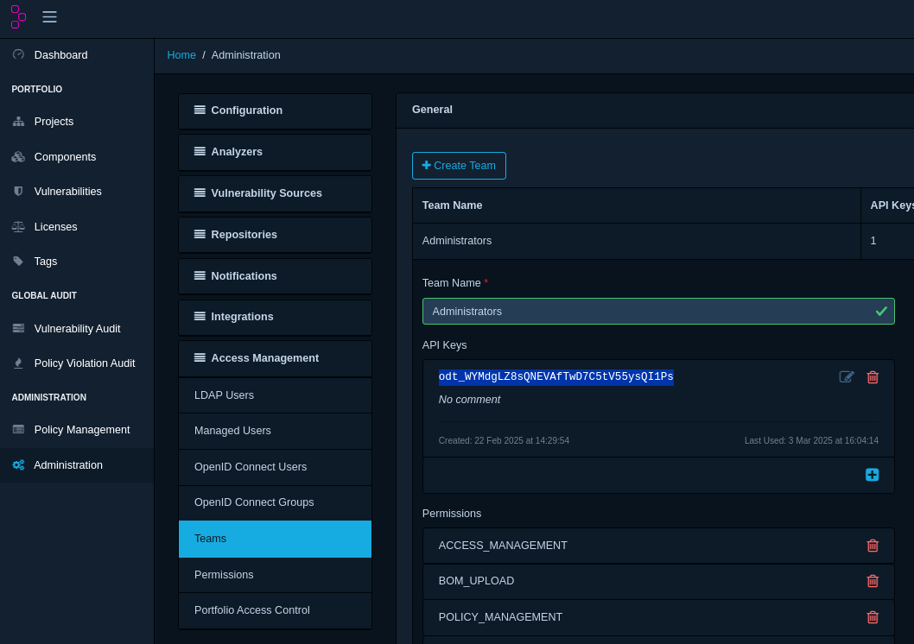
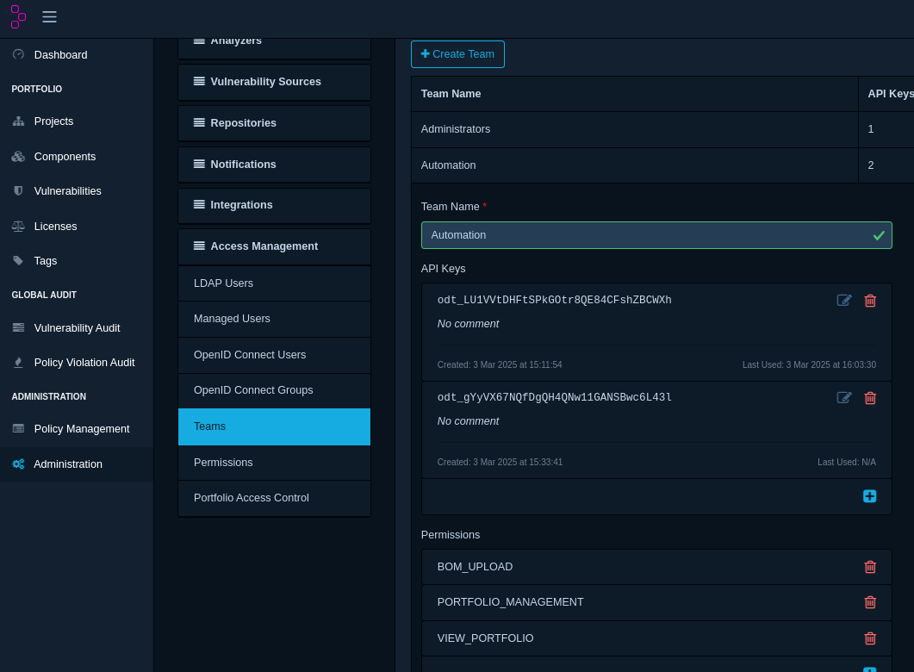

# Setup running instance of Dependency-Track

To upload SBOMs in dtrack, you'll first need a running instance of Dependency-Track and a valid API token.

## ✅ Set Up Dependency-Track (Local via Docker)

1. Run a DependencyTrack locally in your system via [docker](https://docs.dependencytrack.org/getting-started/deploy-docker/#quickstart-manual-execution).

```bash
# Pull the image
docker pull dependencytrack/bundled

# Create persistent volume
docker volume create --name dependency-track

# Run Dependency-Track with 8GB RAM on port 8080
docker run -d -m 8192m -p 8080:8080 --name dependency-track \
  -v dependency-track:/data dependencytrack/bundled
```

2. Visit: <http://localhost:8080>

3. Login with:

- Username: `admin`
- Password: `admin`

4. Change the password when prompted.

## 🔐 Get a DTRACK API Key

5. Go to **Administration** → **Access Management** → **Teams**
6. Click on **Administrator** or create a team like **Automation**
7. Copy the generated API key



**NOTE**:

If using a team like Automation, ensure it has these permissions:

- `VIEW_PORTFOLIO`
- `BOM_UPLOAD`
- `PORTFOLIO_MANAGEMENT`

- **Automation** keys are best for CI/CD pipelines.

see image below:



8. Export the API key before running sbommv:

```bash
export DTRACK_API_KEY="your_token_here"
```
